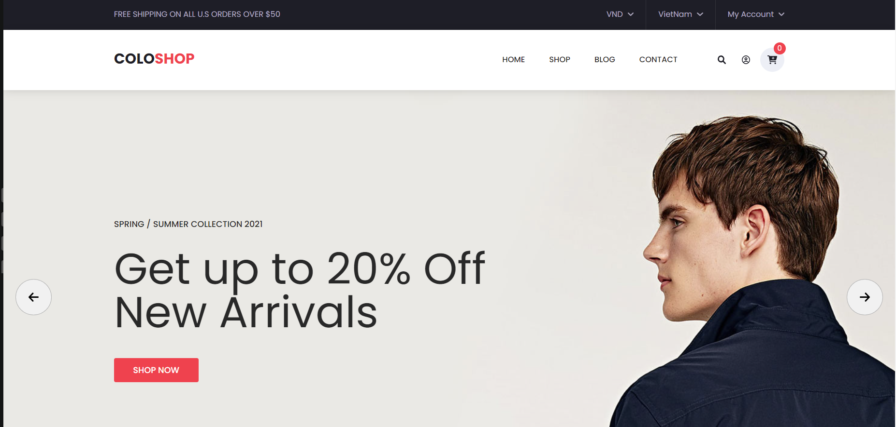

# Mini Project: Website Ecommmerce

## Setup environment

Github Project: https://github.com/minhtrung0110/shop-ecommerce.git

### 1. Setup ReactJS App via Create React App

> Link: https://create-react-app.dev/docs/getting-started/

### 2. Add SCSS support

```js
npm i --save-dev node-sass
```

### 3. Add react router

```
npm i --save react-router-dom
```

### 4. Add redux

```
npm i redux redux-react redux-devtools-extension
```
### 4. Add Classnames

```
npm i classnames
```
### 4. Add Font Awesome

```
npm i --save @fortawesome/fontawesome-svg-core
npm install --save @fortawesome/free-solid-svg-icons
npm install --save @fortawesome/react-fontawesome

```
### 4. Add  axios

```
npm i axios
```
### 4. Add customize-cra

```
npm i customize-cra react-app-rewired --dev
```

## Tổ chức folder

```
src
|__ assets
|__ components
|__ config
|__layouts
|__pages
|__redux
|__routers
|__services
|__utils

```

## Tổ chức routing

- publicRoutes là các địa chỉ không bị giới hạn đăng nhập ngược lại privateRoutes là các địa chỉ yêu cầu đăng nhập
- 

```js
// App.js
function App() {

    return (
        <Router>
            <div className="App">
                <Routes>
                    {

                        publicRoutes.map((item,index) => {

                            let Layout =DefaultLayout
                            if(item.layout===null) Layout = Fragment
                            else
                            if(item.layout) Layout = item.layout

                            return <Route key={index} path={item.path}
                                          element={
                                              <Layout>{item.component}</Layout>
                                          }
                            ></Route>
                        })
                    }

                </Routes>
            </div>
        </Router>
    );
}

```


## Gui Website
 - Thiết Kế Có Sẵn

### Home Page

## To Be Continued